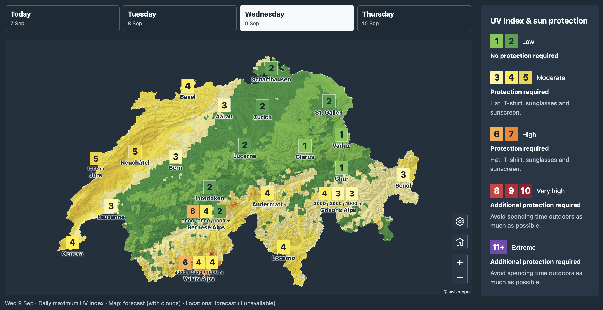

# icon-uv

**icon-uv calculates the UV Index from ICON weather forecasts and CAMS atmospheric
composition.** It provides a Python API and command-line tools for Switzerland
and the surrounding area, producing:

- Hourly UV Index, clear-sky UV and direct/diffuse irradiance on the native ICON grid.
- Point forecasts using a supplied elevation, surface albedo and terrain horizon.
- Daily JSON data for town and mountain-elevation maps, including rounded values,
  categories, source timestamps and data-quality information.

Calculations run locally using a bundled radiation lookup table. An external
radiative-transfer solver is only needed when rebuilding that table.

[](docs/meteoswiss-map.md)

## Installation

Python 3.11 or newer and [uv](https://docs.astral.sh/uv/) are required for the
following setup:

```sh
git clone https://github.com/ofuhrer/icon-uv.git
cd icon-uv
uv sync --locked --extra cams
uv run --no-sync icon-uv --help
```

The `cams` extra installs the ADS download client. Configure an ADS account and
accept the dataset terms using the [CAMS API setup instructions](https://ads.atmosphere.copernicus.eu/how-to-api).
ICON downloads use the public MeteoSwiss STAC service without an account.
To install into an existing Python environment, use `pip install '.[cams]'`
from the repository directory. Omit `[cams]` when working only with saved inputs.

## Calculate UV fields

Choose an available **00 UTC ICON cycle** and the **preceding day's 12 UTC CAMS
cycle**. Replace the date placeholders below; published ICON files have limited
retention. This example retrieves enough hours for two Swiss local-day products.

```sh
ICON_REFERENCE="YYYY-MM-DDT00:00:00Z"
CAMS_REFERENCE="YYYY-MM-DDT12:00:00Z"  # preceding calendar day

uv run --no-sync icon-uv fetch-icon \
  --reference "$ICON_REFERENCE" --first-lead 1 --last-lead 48 \
  --output work/icon.nc

uv run --no-sync icon-uv fetch-cams \
  --reference "$CAMS_REFERENCE" --first-lead 12 --last-lead 60 \
  --output work/cams.grib

uv run --no-sync icon-uv run \
  --icon work/icon.nc --cams work/cams.grib --output work/uv.nc
```

Leads are interval boundaries in hours after initialization: ICON leads 1–48
produce 47 hourly intervals. `--bbox W S E N` selects a geographic subset during
download; the default is 5.3–11.2°E, 45.2–48.4°N. CAMS coverage must enclose the
ICON cells and bracket their interval midpoints. Keep downloaded files to repeat
a calculation offline.

Read the result with xarray:

```python
import xarray as xr

with xr.open_dataset("work/uv.nc") as grid:
    print(grid[["uvi", "clear_sky_uvi", "quality_flag"]])
    hourly_uvi = grid.uvi.isel(cell=0).load()
```

`uvi(time, cell)` is an hourly mean. `time` is the UTC interval midpoint;
`time_bounds` gives its start and end. Native cell IDs, coordinates, elevations
and input-source identities accompany the fields. See the
[output reference](docs/outputs.md) for variables, units and quality flags.

## Generate daily map data

The `daily` command exports today's and tomorrow's values for a location catalog.
The supplied issue time determines the local dates in Europe/Zurich, making
replays reproducible. Set it to your intended issuance on the ICON cycle's date:

```sh
ISSUED_AT="YYYY-MM-DDT06:00:00Z"

uv run --no-sync icon-uv daily \
  --grid work/uv.nc --catalog examples/product_locations.json \
  --issued-at "$ISSUED_AT" --output work/daily-uv.json
```

Each value is a daily maximum of a reconstructed 30-minute mean, evaluated every
five minutes. Towns use a nearby native cell; mountain entries use native cells
near 1000, 2000 or 3000 m within a region. The JSON includes raw UVI, its rounded
display value, category and `ok`, `degraded` or `unavailable` status.

The [daily-products guide](docs/daily-products.md) explains custom catalogs,
regional aggregation, freshness and missing-data handling. It also shows how
to use twelve solar samples per hour when computing the input grid.

The [examples overview](examples/README.md) covers the included inputs and scripts.
The [MeteoSwiss map example](docs/meteoswiss-map.md) provides 30 town locations
and six mountain regions, including the Jura elevation exception, with a script
that exports four days and builds an English HTML map with
zoom, pan, day selection and forecast/clear-sky shading. The [example page](examples/map/index.html)
and its separate JSON data files are included; serve them with a local HTTP server
as described in the guide. New forecasts use all 21 ICON members by default; daily products report their
median and uncertainty. The included dated map snapshot uses CTRL.

## Ensemble and CTRL forecasts

`fetch-icon` downloads **all 21 ICON-CH2-EPS members by default**. `run` and `poi`
retain the member dimension and calculate UV independently for each member.
`daily` reports the **median of the member daily products**, plus P10/P50/P90,
individual member values and uncalibrated exceedance frequencies for UVI 3, 6,
8 and 11. Regional aggregation is performed within each member first. Missing inputs are
tracked; daily values need at least 90% of the requested members (19 of 21).
`fetch-icon --minimum-member-fraction 0.8` changes the default coverage threshold.

To use only the deterministic CTRL forecast, add `--control` when downloading:

```sh
uv run --no-sync icon-uv fetch-icon --control \
  --reference "$ICON_REFERENCE" --first-lead 1 --last-lead 48 \
  --output work/icon-control.nc
uv run --no-sync icon-uv run --icon work/icon-control.nc --cams work/cams.grib \
  --samples 12 --output work/uv-control.nc
```

Use that grid with `daily` or `poi`; no further CTRL option is needed.
Python callers use `fetch_icon(..., ensemble=False)`. Ensemble data and UV
calculations require roughly 21 times the member-dependent work of CTRL.
See [ensemble products](docs/daily-products.md#ensemble-products) for reduction
choices, schema details and uncertainty limits.

## Calculate a point forecast

Supply the point's coordinates, altitude, UV albedo and horizon:

```python
import xarray as xr
from icon_uv.products import POI, compute_pois

site = POI(
    name="my-site", latitude=46.8156, longitude=6.944, altitude_m=491,
    uv_albedo=0.05,
    horizon_degrees=(0.0,) * 36,  # open horizon, samples every 10° from north
)
with xr.open_dataset("work/uv.nc") as grid:
    points = compute_pois(grid.load(), [site])
```

A JSON list of the same fields can be passed to the CLI:

```sh
uv run --no-sync icon-uv poi --grid work/uv.nc \
  --locations examples/davos.json --output work/davos.nc
```

See [point forecasts](docs/outputs.md#point-forecasts) for horizon conventions,
spatial matching and the distinction between ambient and terrain-screened UV.

## How it works

1. **Recover hourly solar radiation.** ICON provides surface shortwave radiation
   averaged since initialization. Differences between consecutive boundaries
   recover hourly means; pressure, albedo and snow fraction use endpoint averages.
2. **Add atmospheric composition.** CAMS supplies total-column ozone and aerosol
   optical depth at 550 nm, interpolated to each cell and interval midpoint.
3. **Infer cloud attenuation.** A radiation lookup table maps atmospheric state
   and cloud optical thickness to shortwave and erythemal UV irradiance. The
   calculation selects the effective cloud thickness matching ICON shortwave.
4. **Calculate UV Index.** Solar geometry evolves within each hour. Erythemally
   weighted irradiance is integrated and multiplied by 40 to obtain UVI; daily
   and point products reuse the saved atmospheric and cloud state.

The table was generated with libRadtran using plane-parallel DISORT. The
[method description](docs/method.md) covers the physical assumptions, table
ranges and interpolation. [Validation results](docs/validation.md) summarize
measurement comparisons and numerical accuracy. Developer setup and table
rebuilding are documented in [CONTRIBUTING.md](CONTRIBUTING.md).

## Limitations

- Cloud state is hourly; reconstructed subhourly UV follows solar geometry and
  does not resolve rapid cloud changes or three-dimensional cloud effects.
- Atmospheric profiles, water vapour and aerosol optical properties are fixed;
  UV surface albedo is estimated from snow fraction.
- Native-grid terrain can differ from a measurement or target location. Point
  height adjustments and horizon screening approximate local conditions.
- Low-sun accuracy depends on the plane-parallel approximation; twilight is
  omitted. Inputs outside the lookup table's supported ranges are rejected.
- Measurement coverage varies by site, season and weather regime; the reported
  validation statistics describe those sampled conditions.

## Sources and attribution

- [MeteoSwiss ICON documentation](https://opendatadocs.meteoswiss.ch/e-forecast-data/e2-e3-numerical-weather-forecasting-model)
  and [STAC collection](https://data.geo.admin.ch/api/stac/v1/collections/ch.meteoschweiz.ogd-forecasting-icon-ch2).
- [CAMS atmospheric composition forecasts](https://ads.atmosphere.copernicus.eu/datasets/cams-global-atmospheric-composition-forecasts),
  produced by ECMWF for Copernicus.
- [libRadtran](https://www.libradtran.org/), used to generate the radiation table.
- Example Davos terrain geometry derives from
  [swisstopo elevation profiles](https://api3.geo.admin.ch/rest/services/profile.json).

icon-uv is licensed under the [BSD 3-Clause License](LICENSE). Input datasets and
third-party dependencies retain their own licenses and attribution requirements.
