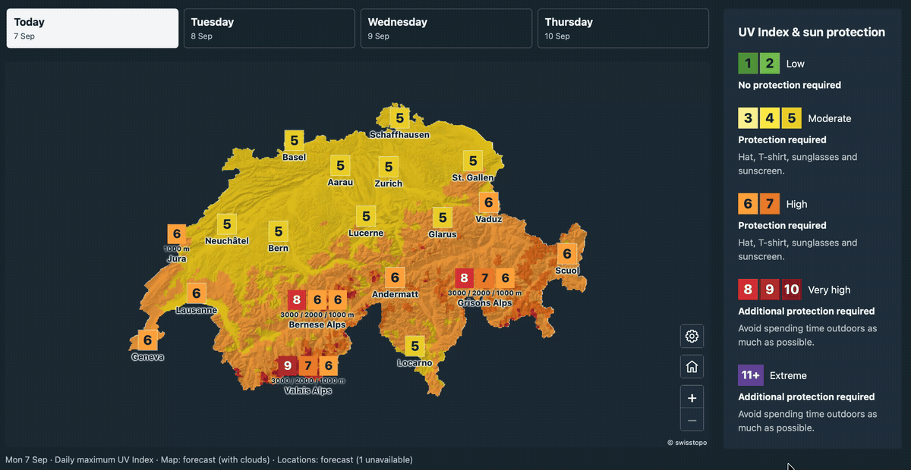

# icon-uv

**Calculate the UV Index from ICON weather forecasts and CAMS atmospheric
composition.** icon-uv provides a Python API and command-line tools for hourly
grid and point forecasts, plus daily JSON products for towns and mountain regions.
Point and daily products share one location catalog: coordinates and elevation
are enough, with ICON-derived albedo and ambient horizontal UV by default.
Calculations run locally using a bundled radiation lookup table.

[](meteoswiss-map.md)

## Installation

Install from PyPI with Python 3.11 or newer:

```sh
pip install 'icon-uv[cams]'
icon-uv --help
```

The `cams` extra adds the ADS download client. Omit it when working only with
saved inputs. CAMS downloads require an ADS account and accepted dataset terms;
follow the [CAMS API setup instructions](https://ads.atmosphere.copernicus.eu/how-to-api).
ICON downloads use the public MeteoSwiss STAC service without an account.

## Try it without credentials

Clone the repository to get the example scripts, then use
[uv](https://docs.astral.sh/uv/) to install the locked dependencies:

```sh
git clone https://github.com/ofuhrer/icon-uv.git
cd icon-uv
uv sync --locked --extra cams
uv run --no-sync python examples/offline.py --output-dir work/offline
```

The example creates synthetic ICON/CAMS inputs, runs the bundled radiation
table, and writes hourly grid and point NetCDF and daily JSON. It needs no
network access or credentials after installation. Its September 2026 dates
illustrate the formats; the output is not a weather forecast.

## Calculate UV fields

Choose an available **00 UTC ICON cycle** and the **preceding day's 12 UTC CAMS
cycle**. Published ICON files have limited retention. Replace both date placeholders:

```sh
ICON_REFERENCE="YYYY-MM-DDT00:00:00Z"
CAMS_REFERENCE="PREVIOUS-YYYY-MM-DDT12:00:00Z"

uv run --no-sync icon-uv fetch-icon \
  --reference "$ICON_REFERENCE" --first-lead 1 --last-lead 48 \
  --output work/icon.nc
uv run --no-sync icon-uv fetch-cams \
  --reference "$CAMS_REFERENCE" --first-lead 12 --last-lead 60 \
  --output work/cams.nc
uv run --no-sync icon-uv run \
  --icon work/icon.nc --cams work/cams.nc --samples 12 --output work/uv.nc
```

ICON leads are interval boundaries: 1–48 produces 47 hourly intervals, covering
two Swiss daylight dates. `--bbox W S E N` selects a subset; the default covers
Switzerland and its surroundings. Keep the downloaded NetCDF inputs for offline
recalculation. Downloads use all 21 ICON members; add `--control` to `fetch-icon`
for CTRL only. Outputs retain member-specific cloud and surface conditions.

Use the saved grid with the [location API](location-api.md) to calculate hourly
points or publish daily JSON. Input coverage must include each requested daylight
period; see [daily products](daily-products.md).

## Choose a guide

| Task | Guide |
|---|---|
| Use one location catalog for hourly and daily products | [Location API](location-api.md) |
| Export daily peaks, categories and ensemble information | [Daily products](daily-products.md) |
| Read NetCDF variables and quality flags | [Output reference](outputs.md) |
| Build an interactive Swiss UV map | [Map example](meteoswiss-map.md) |
| Understand the model and its physical assumptions | [Calculation method](method.md) |
| Understand verification results and their limits | [Verification and validation](validation.md) |

Development instructions are in
[CONTRIBUTING.md](https://github.com/ofuhrer/icon-uv/blob/main/CONTRIBUTING.md).
See [Releasing](releasing.md) for package publishing. Report problems through
[GitHub issues](https://github.com/ofuhrer/icon-uv/issues).

This site tracks `main`. Install from the repository to use the API documented here.
Released source and documentation are available in [GitHub releases](https://github.com/ofuhrer/icon-uv/releases).
